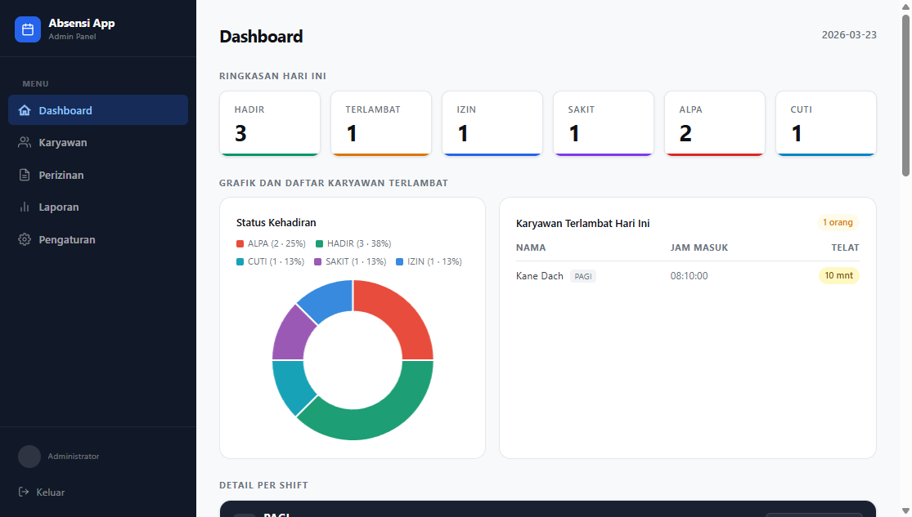
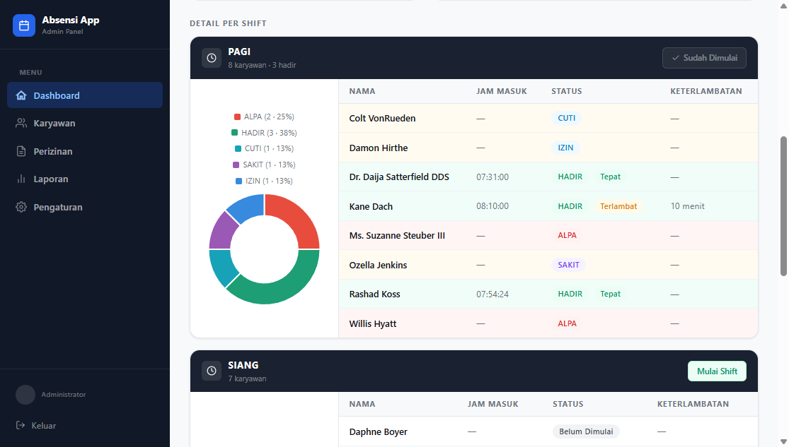
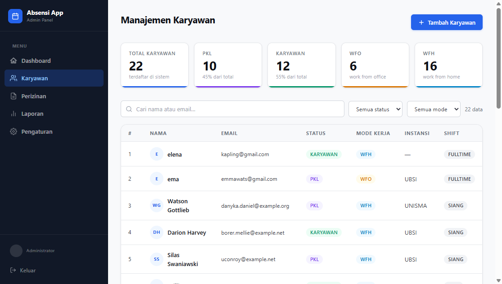
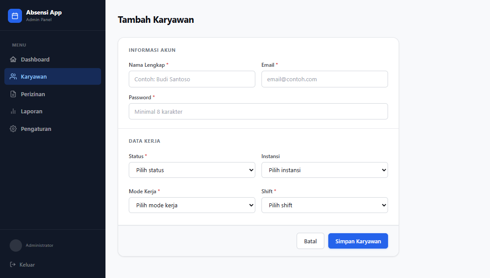
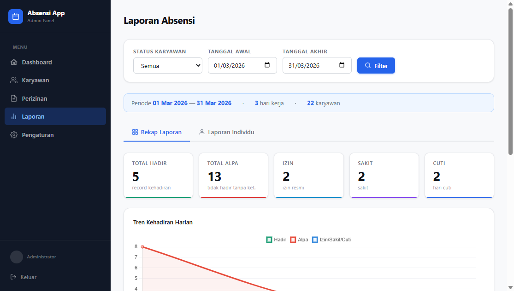
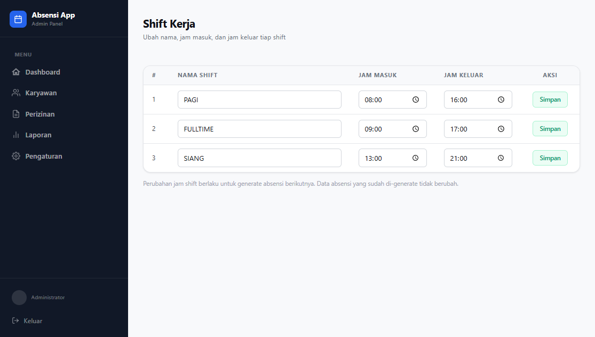

# Sistem Manajemen Absensi

Aplikasi manajemen absensi berbasis web untuk memonitor kehadiran karyawan, menganalisis data absensi, dan menghasilkan laporan secara efisien.

---

### Dashboard Absensi

Menampilkan ringkasan data kehadiran, statistik, serta grafik tren harian dan distribusi status.

---

### Halaman Karyawan

Menampilkan semua karyawan yang terdaftar

---

### Laporan Karyawan

Menampilkan data seluruh karyawan lengkap dengan rekap kehadiran, keterlambatan, dan persentase kehadiran.

---

### Pengaturan

Fitur untuk mengubah jam shift.

---

## Teknologi

- Laravel
- Blade
- JavaScript
- Chart.js
- Laragon / MySql

---
