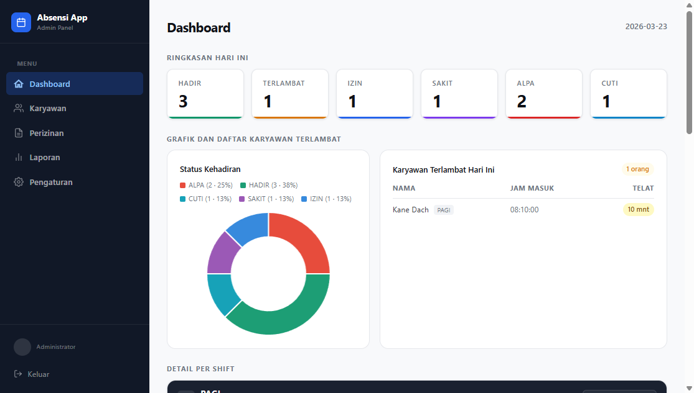
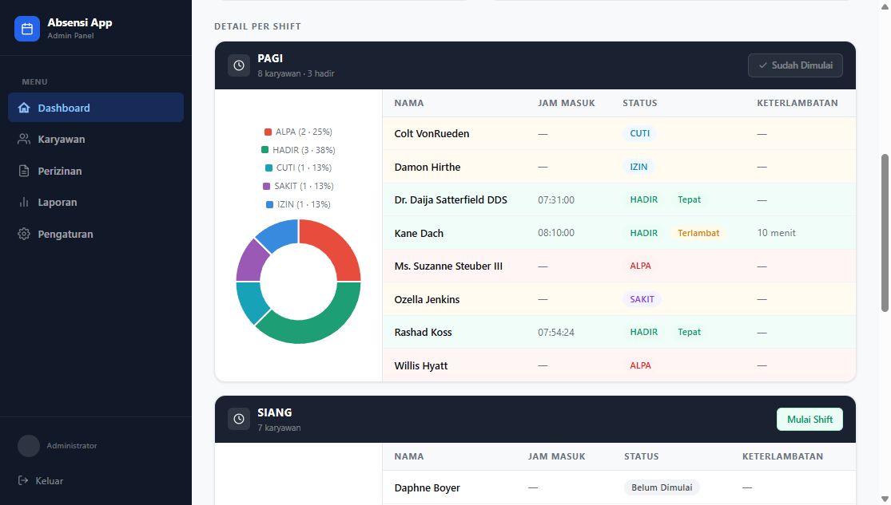
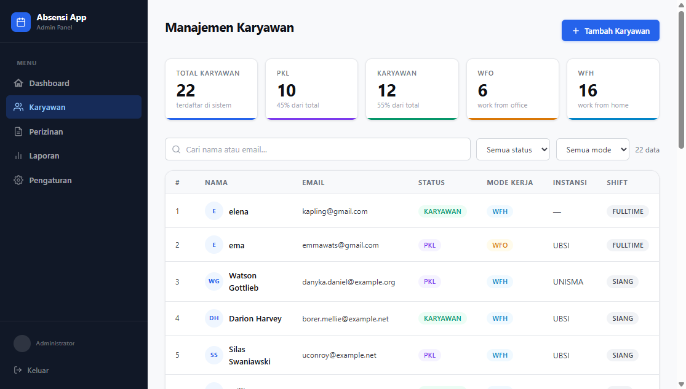
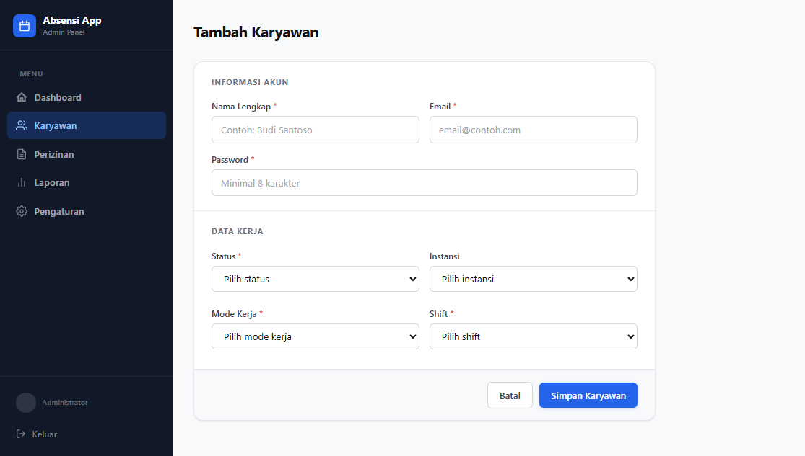
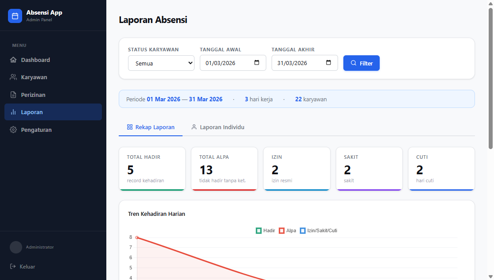
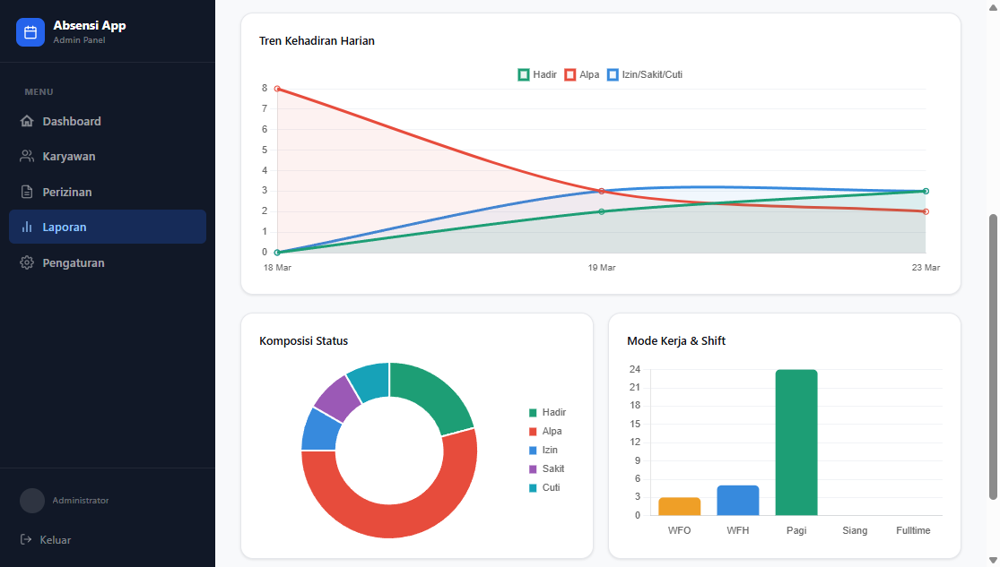
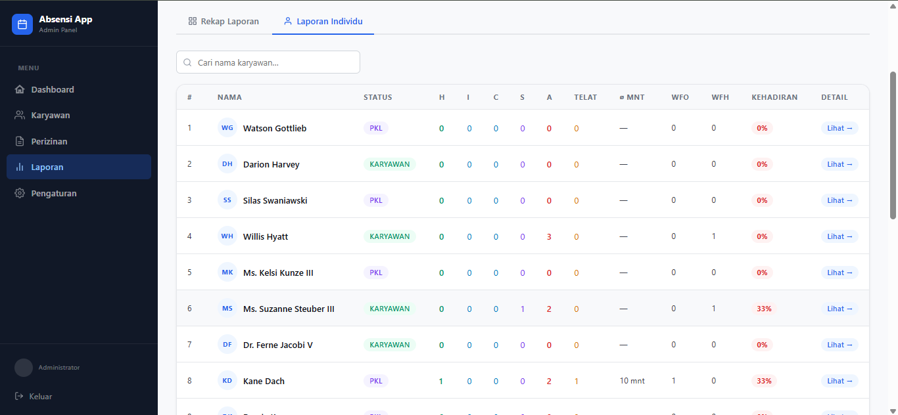
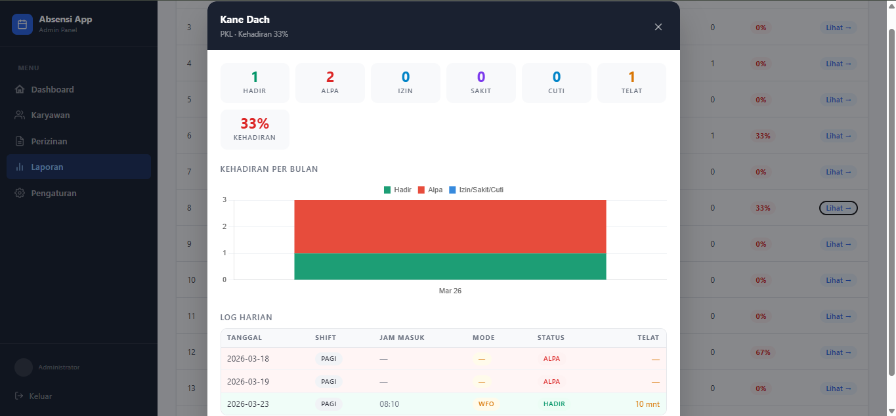
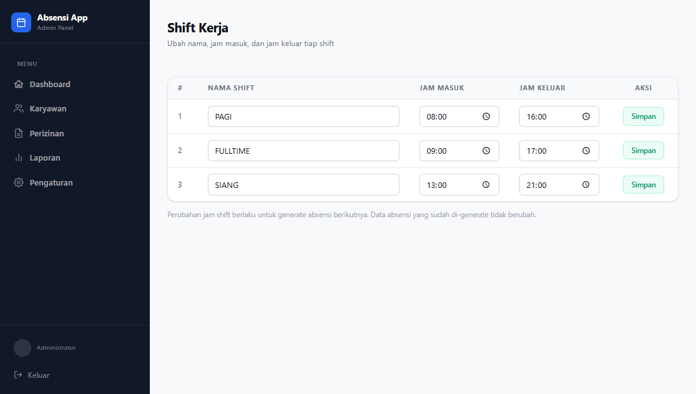

# Sistem Manajemen Absensi

Aplikasi manajemen absensi berbasis web untuk memonitor kehadiran karyawan, menganalisis data absensi, dan menghasilkan laporan secara efisien.

---

## Dashboard Absensi

Menampilkan ringkasan data kehadiran, statistik, serta grafik tren harian dan distribusi status.




---

## Halaman Karyawan

Menampilkan semua karyawan yang terdaftar.




---

## Laporan Karyawan

Menampilkan data seluruh karyawan lengkap dengan rekap kehadiran, keterlambatan, dan persentase kehadiran.






---

## Pengaturan

Fitur untuk mengubah jam shift.



---

## Teknologi

- Laravel
- Blade
- JavaScript
- Chart.js
- Laragon
- MySQL

---

## Cara Menjalankan

### 1. Clone Repository

```bash
git clone https://github.com/username/absensi-admin.git
cd absensi-admin
```

### 2. Install Dependency

```bash
composer install
```

### 3. Salin File Environment

```bash
cp .env.example .env
```

### 4. Konfigurasi Database

Sesuaikan konfigurasi database pada file `.env`.

```env
DB_DATABASE=nama_database
DB_USERNAME=root
DB_PASSWORD=
```

### 5. Generate Application Key

```bash
php artisan key:generate
```

### 6. Jalankan Migrasi (jika diperlukan)

```bash
php artisan migrate
```

### 7. Jalankan Server

```bash
php artisan serve --host=0.0.0.0
```

Server akan berjalan pada:

```
http://IP_SERVER:8000
```

Ganti `IP_SERVER` dengan alamat IP komputer/server tempat aplikasi dijalankan. Alamat ini nantinya digunakan pada aplikasi frontend/karyawan sebagai URL API.

Contoh:

```
http://192.168.1.10:8000
```

---

## Aplikasi Karyawan

Frontend untuk karyawan tersedia pada repository berikut:

https://github.com/nur-santo/absensi-user
